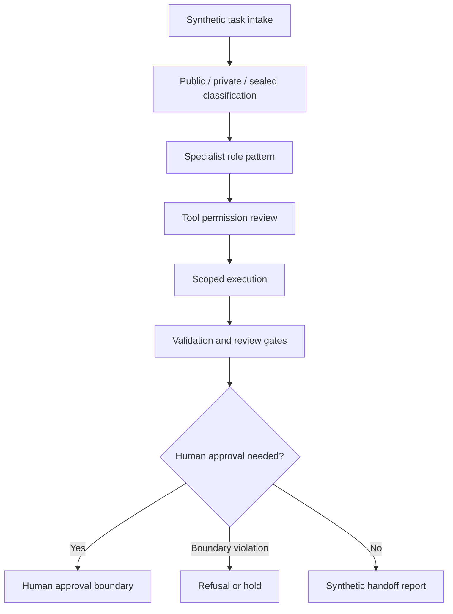

# Codex-Style Execution Loop

Status: scaffolded

## Problem Statement

Define a public-safe agentic engineering execution loop that shows how AI-assisted work can be scoped, reviewed, validated, refused, logged, and handed off under human authority without active agent workforce claims, autonomous production agents, internal prompts, private agent memory, sealed agent memory, live tool tokens, credentials, private repo paths, customer data, production execution logs, private runtime details, or released software claims.

## Synthetic Agentic Execution Context

The example is a synthetic task lifecycle for a mock documentation patch. It does not describe an active agent workforce, autonomous production agent system, production execution, live tool token use, released software, or private runtime.

The workflow demonstrates:

- task intake and boundary classification;
- specialist role selection;
- tool permission review;
- scoped implementation;
- validation and handoff;
- refusal or hold behavior;
- human approval before publication, metadata, routing, or release decisions.

## Human Authority Rule

Humans remain architectural authority. Agents may assist with scoped execution, documentation, checks, and handoff, but they do not approve public creation, publication, metadata changes, routing patches, release state, proof completion, or refusal overrides.

## Specialist Role Pattern

| Role pattern | Synthetic responsibility | Boundary |
| --- | --- | --- |
| Planner | Converts request into bounded execution plan | No private prompts or autonomous authority |
| Implementer | Applies scoped patches to approved files | No private repo paths or production execution |
| Validator | Runs public-safe checks and reports results | No production execution logs or private telemetry |
| Reviewer | Summarizes risks, held items, and approval needs | Human authority remains upstream |

These roles are public-safe task patterns only, not active agent workforce claims.

## Tool Permission Matrix Summary

| Tool class | Default posture | Escalation trigger |
| --- | --- | --- |
| Read-only inspection | Allowed when scoped | Boundary-bearing or sealed material appears |
| File edits | Allowed only when explicitly requested | Unlisted files, private source, or production workflow appears |
| Validation commands | Allowed when public-safe | Commands require credentials, endpoints, or live tokens |
| Git staging / commit | Allowed only when explicitly requested | Unrelated changes are present |
| Remotes / push / metadata | Held | Human approval required |

## Review Gate Lifecycle

1. Intake: confirm requested scope, target files, and held actions.
2. Boundary classify: public, private, sealed, or hold.
3. Plan: describe intended edits and validation.
4. Execute: patch only approved surfaces.
5. Validate: run boundary, status, whitespace, and repo checks.
6. Review: report changed files, validation results, risks, and held items.
7. Handoff: stop before public creation, metadata, routing, push, publication, or release unless separately approved.

## Synthetic Task Lifecycle

| Stage | Input | Output |
| --- | --- | --- |
| Request | Human-scoped task | Bounded task brief |
| Plan | Target files and constraints | Public-safe execution plan |
| Patch | Approved local files | Scoped changes |
| Validate | Boundary/status checks | Validation report |
| Handoff | Diff and status | Human review packet or final report |
| Hold/refuse | Boundary violation | Stop reason and review need |

## Logging And Refusal Rules

Logging templates must stay synthetic and redacted. They must not contain internal prompts, private agent memory, sealed agent memory, live tool tokens, credentials, private repo paths, customer data, Foundation-private data, production execution logs, private runtime details, or private telemetry.

Refusal or hold is required when a task asks for:

- credentials or live tool tokens;
- private repo paths, private source, or sealed agent memory;
- customer data or Foundation-private data;
- production execution, production workflows, or production execution logs;
- autonomous production agent behavior;
- released software or proof-completion claims without reviewed evidence.

## Human Approval Boundary

Human approval is required before GitHub repo creation, adding remotes, pushing, publishing, changing metadata, routing through `Franzabner`, routing through `franzabner-proof-stack`, marking artifacts released, or changing any public proof status.

## Mermaid Agent Task Review-Flow Diagram

## Validation Questions

- Does the artifact avoid active agent workforce and autonomous production agent claims?
- Does it avoid internal prompts, private agent memory, sealed agent memory, live tool tokens, credentials, private repo paths, customer data, Foundation-private data, production execution logs, private runtime details, and released software claims?
- Are specialist roles framed as synthetic patterns rather than active workforce members?
- Are tool permissions bounded by human approval and refusal rules?
- Are publication, metadata, routing, push, and release actions held for explicit human approval?

## What This Proves

- Agentic engineering workflows can be documented as bounded task lifecycles under human authority.
- Tool permissions, review gates, logging, refusal, and handoff can be described without private runtime details or production execution.
- Human approval boundaries can be made explicit before public creation, metadata, routing, publication, or release.

## What This Does Not Prove

- It does not prove an active agent workforce, autonomous production agents, released software, production execution, or production readiness.
- It does not expose internal prompts, private agent memory, sealed agent memory, live tool tokens, credentials, private repo paths, customer data, Foundation-private data, production execution logs, private runtime details, or private telemetry.
- It does not authorize GitHub creation, remotes, pushes, publication, metadata changes, routing, release, or proof completion.

## Public / Private / Sealed Checklist

| Check | Status |
| --- | --- |
| Status: scaffolded | yes |
| Synthetic agentic execution context only | yes |
| Human authority rule stated | yes |
| No active agent workforce or autonomous production agent claims | yes |
| No internal prompts, private agent memory, or sealed agent memory | yes |
| No live tool tokens, credentials, or private repo paths | yes |
| No customer data, Foundation-private data, production execution logs, or private runtime details | yes |
| No released software claims | yes |
| Profile routing and proof-stack routing remain planned | yes |
